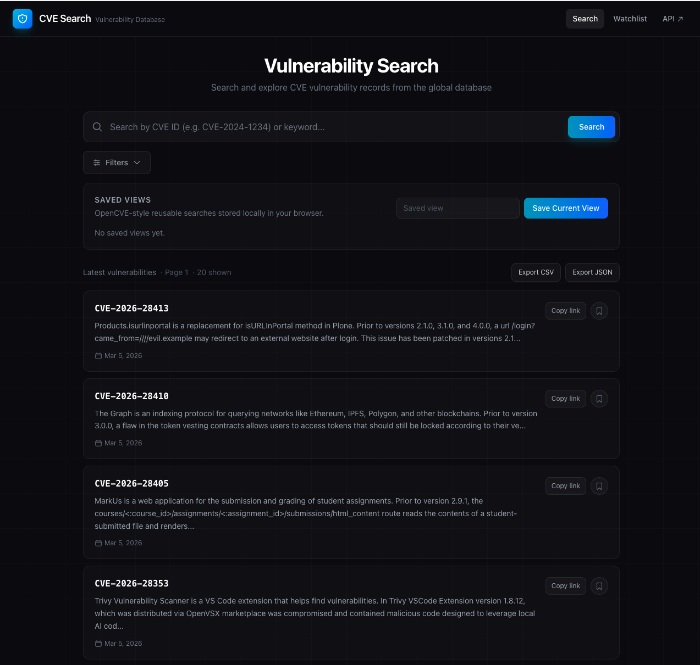
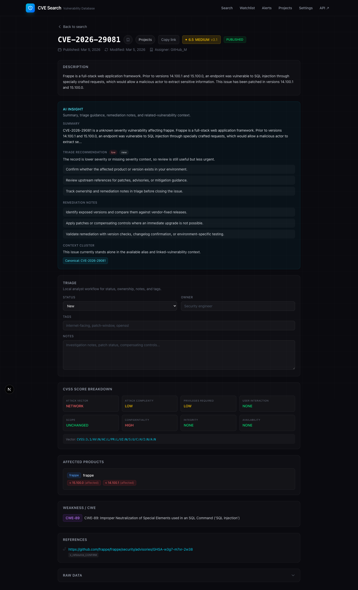

# CVE Search

Fast, analyst-friendly CVE search and triage built with Next.js and powered by the [CIRCL vulnerability-lookup API](https://vulnerability.circl.lu/).

[](https://nextjs.org/)
[](https://react.dev/)
[](https://www.typescriptlang.org/)
[](https://tailwindcss.com/)
[](./LICENSE)

## Overview

CVE Search turns raw vulnerability data into a workflow-oriented web app for research, prioritization, and lightweight tracking.

It combines URL-driven search, rich CVE detail pages, saved views, watchlists, alerts, triage state, and project grouping in a single interface. The app is designed to feel closer to an analyst workstation than a simple API browser.

It also includes an optional AI layer for natural-language search, analyst-facing CVE summaries, remediation guidance, and cross-workspace digests, with provider settings stored locally in the browser.

## Screenshots

### Search Interface


### CVE Detail View


## Highlights

- URL-driven search state for shareable result pages
- Direct CVE lookup plus keyword/product search
- Vendor and product browse assist
- Severity filters and result sorting
- Server-rendered homepage results
- Rich CVE detail pages with EPSS, CWE, CAPEC, references, comments, and linked vulnerabilities when available
- Saved views, watchlist, alerts, and triage workflow
- Server-persisted projects workspace
- AI-assisted search, summaries, triage guidance, and workspace digests
- Export to CSV and JSON
- Upstream response validation and hardened proxy behavior

## Feature Set

### Search and Prioritization

- Search by CVE ID such as `CVE-2024-1234`
- Search by keyword or product
- Filter by vendor/product pair, CWE, published-since date, and minimum severity
- Sort by newest, oldest, highest CVSS, or lowest CVSS
- Copy deep links to exact search states

### Analyst Workflow

- Save reusable searches as local saved views
- Bookmark CVEs and advisories in a local watchlist
- Create local alert rules and review matches in an alerts center
- Track local triage status, owner, tags, and notes
- Group CVEs into server-persisted projects stored in the workspace

### AI Workspace

- Translate natural-language prompts into structured search filters
- Generate analyst-friendly CVE summaries and triage recommendations
- Draft remediation notes from affected products, references, and available metadata
- Build watchlist, alerts, and project digests from current workspace context
- Configure provider, model, and API key in a browser-local settings page

### Vulnerability Detail

- CVSS score breakdown and severity badges
- EPSS lookup when a real CVE identifier is available
- Structured affected product rendering
- CWE enrichment when available
- CAPEC entries, comments, linked vulnerabilities, and references when present upstream
- Raw source payload for deeper inspection

### Engineering Quality

- Server-rendered initial result loading
- URL-first state management
- Server-side API proxy with allowlisting and timeout handling
- Upstream response validation for key CIRCL payloads
- Automated lint, test, and build checks in CI
- Heuristic AI fallback when no model provider is configured

## Current Boundaries

- Vendor-only filtering is intentionally blocked because the current upstream flow is only trustworthy when vendor is paired with product.
- Saved views, watchlist, alerts, and triage state are browser-local, not synced across devices or users.
- AI provider settings and API keys are stored in browser local storage and are not encrypted.
- Projects are persisted in the app workspace via JSON storage, not a production database.
- Team assignments, user accounts, email or Slack notifications, and scheduled reports are not implemented.

## Quick Start

```bash
git clone https://github.com/rupertgermann/cvesearch.git
cd cvesearch
npm install
npm run dev
```

Open `http://localhost:3000`.

To use model-backed AI features instead of the built-in heuristic fallback, open `/settings` in the app and configure:

- provider
- model
- API key

## Scripts

```bash
npm run dev
npm run lint
npm test
npm run build
npm start
```

## Testing

The project includes lightweight TypeScript tests for:

- search-state parsing and URL generation
- prioritization and local alert matching
- triage helpers
- upstream response validation
- project helper logic
- CVSS and description extraction

GitHub Actions runs `lint`, `test`, and `build` on pushes and pull requests.

## Project Structure

```text
src/
├── app/
│   ├── api/
│   │   ├── ai/              # AI summary, search, and digest APIs
│   │   ├── projects/        # Workspace project APIs
│   │   └── proxy/           # CIRCL proxy
│   ├── alerts/              # Alerts route
│   ├── cve/[id]/            # CVE detail route
│   ├── projects/            # Projects route
│   ├── settings/            # Browser-local AI provider settings
│   ├── watchlist/           # Watchlist route
│   └── page.tsx             # Homepage
├── components/              # Search, detail, workflow, and navigation UI
└── lib/                     # Search logic, AI helpers, API clients, storage, validation, utilities

data/
└── projects.json            # Workspace project persistence

tests/                       # Node-based TypeScript test suite
```

## API Usage

The app talks to CIRCL through `/api/proxy`, which forwards to `https://vulnerability.circl.lu/api`.

Primary upstream endpoints:

- `GET /api/vulnerability/`
- `GET /api/vulnerability/{id}`
- `GET /api/vulnerability/search/{vendor}/{product}`
- `GET /api/vulnerability/browse/`
- `GET /api/vulnerability/browse/{vendor}`
- `GET /api/epss/{cve_id}`
- `GET /api/cwe/{cwe_id}`

## Docs

Planning and benchmark docs live in [`docs/`](./docs):

- `docs/review-findings.md`
- `docs/improvement-plan.md`
- `docs/execution-backlog.md`
- `docs/opencve-benchmark.md`
- [`CHANGELOG.md`](./CHANGELOG.md)

## Tech Stack

- Next.js 16
- React 19
- TypeScript 5
- Tailwind CSS 4
- CIRCL vulnerability-lookup
- Optional OpenAI or Anthropic provider integration

## License

[MIT](./LICENSE)
